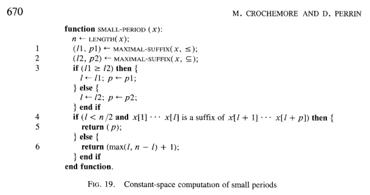

Earlier this week I noticed that some of the methods for [string slices in Rust](http://static.rust-lang.org/doc/master/std/str/trait.StrSlice.html) were missing documentation examples, so I endeavored to write some. The first method I tried to write an example for was the `contains` method, which tests if one string is a substring of another. After some thought I settled on this example:

    "bananas".contains("nana")

Since I had never used this method, I wanted to verify that it worked in the way I expected, so I went to [play.rust-lang.org](http://play.rust-lang.org/) to try it out.

It returned `false`.

After double-checking the documentation and trying other examples (which all worked), I suspected that play.rust-lang.org had some strange problem with it. I decided to run a test locally. Same result. I downloaded the latest Rust nightly and ran it again. Once more, Rust informed me that "bananas" does not contain "nana".

I decided to check `contains` on every substring of "bananas" to verify that this was, in fact, real life, and that I hadn't suddenly forgotten how letters work:

```rust
    fn main() {
        let b = "bananas";
        for i in range(0, b.len()) {
            for j in range(i, b.len() + 1) {
                let curr = b.slice(i, j);
                println!("{} - {}", b.contains(curr), curr);
            }
        }
    }
```

Running this resulted in:

    true - 
    true - b
    true - ba
    true - ban
    true - bana
    true - banan
    true - banana
    true - bananas
    true - 
    true - a
    true - an
    true - ana
    true - anan
    true - anana
    true - ananas
    true - 
    true - n
    true - na
    true - nan
    false - nana
    true - nanas
    true - 
    true - a
    true - an
    true - ana
    true - anas
    true - 
    true - n
    true - na
    true - nas
    true - 
    true - a
    true - as
    true - 
    true - s

"nana" was the only substring of "bananas" for which the `contains` method returned `false`. Wats abound.

I was delighted. I had found a bug in Rust's implementation of string matching. Since I had nothing better to do than spend all day hunting down an obscure bug in the standard library of a pre-release programming language, I decided to fix it.

This particular problem was actually the result of two separate bugs. The first bug was in [this code](https://github.com/rust-lang/rust/blob/c88feffde4f5043adf07a6837026f228e20b67e6/src/libcore/str.rs#L562-L576):

```rust
    impl Searcher {
        fn new(haystack: &[u8], needle: &[u8]) -> Searcher {
            // FIXME: Tune this.
            if needle.len() > haystack.len() - 20 {
                Naive(NaiveSearcher::new())
            } else {
                let searcher = TwoWaySearcher::new(needle);
                if searcher.memory == uint::MAX { // If the period is long
                    TwoWayLong(searcher)
                } else {
                    TwoWay(searcher)
                }
            }
        }
    }
```

This is a constructor for a `Searcher` object, which performs the actual string matching. The intention of this code to use `NaiveSearcher` when the difference between the length of the `haystack` (the string we're searching in) and the length of the `needle` (the string we're searching for) is less than 20, and to otherwise use `TwoWaySearcher`. (NaiveSearcher is an implementation of the naive string matching algorithm, which I'm guessing is preferred in cases like this because it ends up being faster than the faster string matching algorithm, which has some set up costs associated with it).

However, when `haystack.len()` is less than 20, `haystack.len() - 20` will be a very large number; we have an underflow error on our hands. This bug was causing the code to erroneously use the `TwoWaySearcher` in general for haystacks of length less than 20, but in particular for the case of `"bananas".contains("nana")`. The fix is to add `20` to the needle instead of subtracting it from the haystack:

    if needle.len() + 20 > haystack.len() {

My pull request to fix this first bug is [here](https://github.com/rust-lang/rust/pull/16590).

It is interesting to note that without this first bug, I would not have discovered the original problem, nor would I have discovered that there was a problem with `TwoWaySearcher`.

So that change fixed the problematic example I had found, but only by forcing that match attempt to use a different, simpler string matching algorithm which was (presumably) not broken. Because there were other examples that were broken even after my first fix, it was still necessary to diagnose the problem with `TwoWaySearcher`. In order to do that, I needed to know what the code was trying to do. Unfortunately, the code lacked comments describing which algorithm it was attempting to implement, so I looked at the [PR](https://github.com/rust-lang/rust/pull/14135) that introduced this code in order to try to get more context. From the PR:

 > This changes the previously naive string searching algorithm to a two-way search like glibc, which should be faster on average while still maintaining worst case linear time complexity.

After some more searching I found [this web page](http://www-igm.univ-mlv.fr/~lecroq/string/node26.html) and [this paper](http://www-igm.univ-mlv.fr/~mac/Articles-PDF/CP-1991-jacm.pdf) about the so-called "Two-Way algorithm". So it was going to be simple, right? Just read the paper, understand the algorithm and then figure out where the current implementation is wrong.

Then I saw the pseudocode in the paper:


This didn't look impossible to understand, but it certainly seemed non-trivial, and I had little desire to wade through it. There was also the fact that the algorithm seemingly worked correctly for the vast majority of examples (recall that "nana" was the only substring of "bananas" for which the algorithm was buggy. Also, this implementation had been in Rust master for 3 months and I was the first person to report an issue). I decided to try to fix the bug without completely understanding how the algorithm worked.

Here's what you need to know: the algorithm takes a string called the haystack, and a string called the needle, and attempts find the first `i` for which the slice `haystack[i:needle.length]` is equal to `needle` (that is, the starting position of the first occurrence of `needle` in `haystack`). To do this, it first "factorizes" the needle into two halves, `(u, v)` (where both `u` and `v` are strings such that `needle = u + v`)

As mentioned above, I found the paper to be a tough read. However [glibc's implementation of Two-way](https://sourceware.org/git/?p=glibc.git;a=blob_plain;f=string/str-two-way.h;hb=HEAD), was helpful due to the fact that it is extraordinarily well-documented. Since the Rust version mostly lacks comments, I decided to read through at least the `glibc` comments to try to get a sense of what was going on.

As it turns out, there's a large `if` statement in glibc's `two_way_long_needle` function that looks like this:

```c
  /* Perform the search. Each iteration compares the right half
     first. */
  if (CMP_FUNC (needle, needle + period, suffix) == 0)
    {
      /* Entire needle is periodic; a mismatch can only advance by the
	 period, so use memory to avoid rescanning known occurrences
	 of the period.  */

      ...

    }
  else
    {
      /* The two halves of needle are distinct; no extra memory is
	 required, and any mismatch results in a maximal shift.  */

      ...

    }
```

Here `suffix` is the starting index of the right half of the needle factorization, and `period` is the period of the right half (for example, the string "abcabcabc" has a period of 3 since the string repeats every 3 characters). Also, `CMP_FUNC` is a macro that the glibc source describes in the following way:

```c
     CMP_FUNC(p1, p2, l) A macro that returns 0 iff the first L
                         characters of P1 and P2 are equal.
```

So the `if` statement is checking whether (using Python slice notation) `needle[:suffix] == needle[period : (period + suffix)]`.

I then looked at the Rust implementation to see whether there was comparable logic. I found this:


```rust
    if needle.slice_to(critPos) == needle.slice_from(needle.len() - critPos) {
        ...
    } else {
        ...
    }
```

To understand this properly, know that `critPos` is the equivalent of `suffix` from the glibc code. The check is similar, but not quite the same. This is checking whether (using the same notation as before) `needle[:suffix] == needle[(n - suffix):]`, where `n` is the length of the needle.

I wondered what would happen if I changed the line in the Rust code to use the same logic from glibc, like so:

```rust
    if needle.slice_to(critPos) == needle.slice(period, period + critPos) {
        ...
    } else {
        ...
    }
```

Answer: it seems to work! I tried all of the erroneous examples I had found and they all came out correct. Bug fixed? Well, not quite, because "I don't understand what this code does, but I adapted it from another implementation and it seems to work" does not inspire confidence. I wanted to understand at least a little bit about where it came from.

Going back to the paper, we can find this pseudocode on p. 670:



Hmm, this looks familiar... Compare it with the [full code](https://github.com/rust-lang/rust/blob/c88feffde4f5043adf07a6837026f228e20b67e6/src/libcore/str.rs#L423-L459) for the `TwoWaySearcher` constructor in the Rust implementation (the original code, not with my proposed fix from above):

    fn new(needle: &[u8]) -> TwoWaySearcher {
        let (critPos1, period1) = TwoWaySearcher::maximal_suffix(needle, false);
        let (critPos2, period2) = TwoWaySearcher::maximal_suffix(needle, true);

        let critPos;
        let period;
        if critPos1 > critPos2 {
            critPos = critPos1;
            period = period1;
        } else {
            critPos = critPos2;
            period = period2;
        }

        let byteset = needle.iter()
                            .fold(0, |a, &b| (1 << ((b & 0x3f) as uint)) | a);

        if needle.slice_to(critPos) == needle.slice_from(needle.len() - critPos) {
            TwoWaySearcher {
                critPos: critPos,
                period: period,
                byteset: byteset,

                position: 0,
                memory: 0
            }
        } else {
            TwoWaySearcher {
                critPos: critPos,
                period: cmp::max(critPos, needle.len() - critPos) + 1,
                byteset: byteset,

                position: 0,
                memory: uint::MAX // Dummy value to signify that the period is long
            }
        }

Ignoring the `byteset` thing, which I do not understand in the slightest, we can see that this is more or less the same code. Both the paper and the Rust code have essentially this structure:

    compute critical_position
    compute period
    
    if [some check] {
        use period
    } else {
        use max(critical_position, needle.length - critical_position) + 1
    }

In the paper, `l` is the `critical_position` and `p` is `period`, whereas in the Rust code `criticalPos` and `period` plays these respective roles. The only difference seems to be the check on the if statement. In the paper we check whether `needle[:l]` is a suffix of `needle[l:(p+l)]`, whereas the Rust code above checks whether `needle[:l]` equals `needle[(n-l):]`, which is not the same thing.

But where does the logic from glibc come into play? The glibc code is checking whether `[needle:l]` equals `needle[p:(p+l)]`, which is... exactly how you check if `needle[:l]` is a suffix of `needle[l:(p+l)]`.

So maybe this fix works. Maybe it doesn't and I should actually take the time to properly understand the algorithm before proposing a fix, or at least leave the fix to someone willing to do that. I've opened a PR for this change [here](https://github.com/rust-lang/rust/pull/16612), but am not very confident that it is correct, for obvious reasons.
