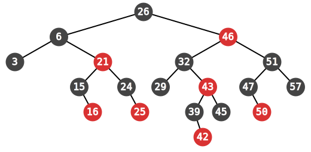
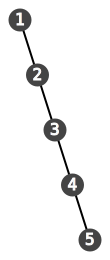

</img>

## Binary search trees

You should know what a [tree](https://en.wikipedia.org/wiki/Tree_(data_structure)) is. (We have to start somewhere). Each node in the trees that we will be considering will have some data attached to it. We are only interested in the cases where all the node data is of the same type.

A **binary search tree** is a binary tree whose node data, which we will call the node's *key*, has some [ordering](http://en.wikipedia.org/wiki/Total_order) to it, and where for every node $n$:

 - every node in the left subtree of $n$ has a key less than $n$'s key
 - every node in the right subtree of $n$ has a key greater than $n$'s key.

Binary search trees are useful because they can enable efficient lookups: if the key we're searching for is strictly less than the current node, we know that we only have to search the left subtree of the current node, since everything in the right subtree is bigger than the current node (and hence bigger than the key). So binary search trees can enable us to eliminate large portions of the search space with a single comparison.

Note that I said "can enable", not "enable". It is possible to create degenerate binary search trees which have slow lookups. For example, if we insert keys $1, 2, 3, 4, 5$ in that order, what we get is a binary search tree that looks like this:

</img>

This is effectively a linked list, and when we search for a key we have to search all nodes in the tree. Such a tree is called **unbalanced**.

TODO: Talk about unbalanced BSTs, define a balanced binary search tree.

## AA trees

A **red-black tree** is a kind of binary search tree. Each node in the tree has a color, either red or black, and there are two kinds of nodes:

 - leaf node: always black, contains no data
 - internal node: can be red or black, has both a key and a value (the set of all keys must have an ordering on it, just like with binary search trees)

In addition, the following rules must be adhered to:

 1. The root node is black
 2. Every red node has two children, and both are black
 3. For any node $n$ and for any descendents $d$ and $e$ of $n$, the path $n \to d$ and the path $n \to e$ have the same number of black nodes

Red-black trees are one instance of a class of data structures called [self-balancing binary search trees](http://en.wikipedia.org/wiki/Self-balancing_binary_search_tree).

The last property gives us something interesting: every node n has a well-defined **black-height**, which is the number of black nodes in any path from n to a leaf node. We will actually define and use a slightly different property: the **level** of a node n is the number of black nodes in any path from n to a leaf node *excluding node n itself*. So if $n$ is a node, then when $n$ is black, $level(n) = black-height(n) - 1$, whereas when $n$ is red, $level(n) = black-height(n)$.

An **AA tree** or **Andersson tree** is a red-black tree which obeys an additional property:

 - Every red node is a right child

Let's see how we can implement an AA tree in [Rust](http://www.rust-lang.org). To model the nodes of an AA tree, we might use an `enum`, which allows one to define algebraic data types in Rust:

    enum Node<K, V> {
        Leaf,
        Internal(InternalNode<K, V>)
    }

    struct InternalNode<K, V> {
        color: Color,
        key: K,
        val: V,
        left: Box<Node<K, V>>,
        right: Box<Node<K, V>>,
    }

    enum Color {
        Red,
        Black
    }

(For the unfamiliar: `Box` is Rust's type for "owned pointers". You might be interested in learning more [here](http://doc.rust-lang.org/guide-pointers.html#boxes))

These type definitions match much of the discussion above:

 - a node is either a leaf or is internal
 - leaves have no data (no children, no key or values, no color (well, they have a color, but it's always black, so we don't need to specify it))
 - internal nodes have a color, a key, a value, and pointers to its child nodes.

This definition meshes with rules 1-3, but we must ensure that the other rules are obeyed as well. However, it turns out that that the above definition is not so easy to work with when it comes to writing an implementation in code.

We can take a different approach by noting that, given the level of each node in the tree, we can completely recover the color information: a node is red if and only if it has the same level as its parent. Also, we don't actually need to create leaf nodes in our code: if we just allow internal nodes to have optional pointers to children, then a missing pointer means there should be a leaf node below. If we define a new kind of binary tree where nodes consist of the following data:

 - key
 - value
 - level (nonnegative integer)
 - optional pointers to left and right children

Then we can ensure that such a tree corresponds to an AA tree by making these rules hold:

 1. leaf nodes have level 1
 2. for any node $n$, if $n$ has a left child $k$, then $level(n) = level(k) + 1$
 3. for any node $n$, if $n$ has a right child $k$, then $level(n) - level(k) = 0$ or $1$
 4. for any node $n$, if $n$ has a parent $p$ and $level(n) = level(p)$, then for any child $k$ of $n$, $level(n) = level(k) + 1$

Rule 2 says that no red node is a left child, and rule 4 says that no child of a red node is red. So any node that obeys these 4 rules clearly corresponds to an AA tree. Similarly, we can transform any AA tree to this form by throwing away the colors and leaf nodes.

Now that we have a more convenient representation of AA trees, let's implement them in Rust!

    type Link<T> = Option<Box<T>>;

    struct Node<K, V> {
        key: K,
        value: V,
        left: Link<Node<K, V>>,
        right: Link<Node<K, V>>,
        level: uint
    }

