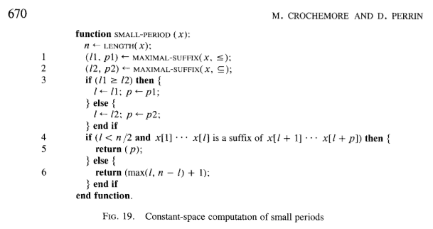

Earlier this week I noticed that some of the methods for [string slices in Rust](http://static.rust-lang.org/doc/master/std/str/trait.StrSlice.html) were missing documentation examples, so I endeavored to write some. The first method I tried to write an example for was the `contains` method, which tests if one string is a substring of another. After some thought I settled on this example:

    "bananas".contains("nana")

Since I had never used this method, I wanted to verify that it worked in the way I expected, so I went to [play.rust-lang.org](http://play.rust-lang.org/) to try it out.

It returned `false`.

After double-checking the documentation and trying other examples (which all worked), I suspected that play.rust-lang.org had some strange problem with it. I decided to run a test locally. Same result. I downloaded the latest Rust nightly and ran it again. Once more, Rust informed me that "bananas" does not contain "nana".

I decided to check `contains` on every substring of "bananas" to verify that this was, in fact, real life, and that I hadn't suddenly forgotten how letters work:

```rust
fn main() {
    let b = "bananas";
    for i in range(0, b.len()) {
        for j in range(i, b.len() + 1) {
            let curr = b.slice(i, j);
            println!("{} - {}", b.contains(curr), curr);
        }
    }
}
```

Running this resulted in:

    true - 
    true - b
    true - ba
    true - ban
    true - bana
    true - banan
    true - banana
    true - bananas
    true - 
    true - a
    true - an
    true - ana
    true - anan
    true - anana
    true - ananas
    true - 
    true - n
    true - na
    true - nan
    false - nana
    true - nanas
    true - 
    true - a
    true - an
    true - ana
    true - anas
    true - 
    true - n
    true - na
    true - nas
    true - 
    true - a
    true - as
    true - 
    true - s

"nana" was the only substring of "bananas" for which the `contains` method returned `false`. Wats abound.

I was delighted. I had found a bug in Rust's implementation of string matching. Since I was in [Hacker School](http://www.hackerschool.com) at the time and had nothing better to do than spend all day hunting down an obscure bug in the standard library of a pre-release programming language, I decided to fix it.

This particular problem was actually the result of two separate bugs. The first bug was in [this code](https://github.com/rust-lang/rust/blob/c88feffde4f5043adf07a6837026f228e20b67e6/src/libcore/str.rs#L562-L576):

```rust
impl Searcher {
    fn new(haystack: &[u8], needle: &[u8]) -> Searcher {
        // FIXME: Tune this.
        if needle.len() > haystack.len() - 20 {
            Naive(NaiveSearcher::new())
        } else {
            let searcher = TwoWaySearcher::new(needle);
            if searcher.memory == uint::MAX { // If the period is long
                TwoWayLong(searcher)
            } else {
                TwoWay(searcher)
            }
        }
    }
}
```

This is a constructor for a `Searcher`, which performs the actual string matching. The intention of this code to use `NaiveSearcher` when the difference between the length of the `haystack` (the string we're searching in) and the length of the `needle` (the string we're searching for) is less than 20, and to otherwise use `TwoWaySearcher`. (NaiveSearcher is an implementation of the naive string matching algorithm, which I'm guessing is preferred in cases like this because it ends up being faster than the more sophisticated string matching algorithm, which has some set up costs associated with it).

However, when `haystack.len()` is less than 20, `haystack.len() - 20` will be a very large number; we have an underflow error on our hands. This bug was causing the code to erroneously use the `TwoWaySearcher` in general for haystacks of length less than 20, but in particular for the case of `"bananas".contains("nana")`. The fix is to add `20` to the needle instead of subtracting it from the haystack:

    if needle.len() + 20 > haystack.len() {

My pull request to fix this first bug is [here](https://github.com/rust-lang/rust/pull/16590).

So that change fixed the problematic "bananas" example I had found, but only by causing the method to use a different, simpler string matching algorithm which was (presumably) not broken. But there was still a problem somewhere in the other string matching algorithm, `TwoWaySearcher`. For example, `"012345678901234567890anana".contains("nana")` still returns false since the haystack is large enough that `TwoWaySearcher` gets used.

This problem (predictably) turned out to be more difficult to pinpoint, and I am not as confident that my proposed fix is correct, so I will just describe it briefly. The `TwoWaySearcher` type is an implementation of the "Two-way algorithm", first introduced in [this paper](http://www-igm.univ-mlv.fr/~mac/Articles-PDF/CP-1991-jacm.pdf). By reading this and the [glibc implementation of Two-way algorithm](https://sourceware.org/git/?p=glibc.git;a=blob_plain;f=string/str-two-way.h;hb=HEAD), which has excellent comments, I noticed that one part of the Rust code did not exactly match what was in the paper. Specifically, on p. 670 of the paper you can find this function:



As a bit of background, the Two-way algorithm takes a string called the "haystack" and a string called the "needle" and attempts to find the starting position of the first occurrence of `needle` in `haystack`, provided that it exists. The first step in this particular algorithm is to "factorize" the needle into halves, (that is, find a pair of strings `(u, v)` such that `needle = u + v`), in a way that obeys certain properties (you can read the paper for the gory details).

Now compare the pseudocode above with the code for the [TwoWaySearcher constructor](https://github.com/rust-lang/rust/blob/c88feffde4f5043adf07a6837026f228e20b67e6/src/libcore/str.rs#L423-L459) in the Rust implementation:

```rust
fn new(needle: &[u8]) -> TwoWaySearcher {
    let (critPos1, period1) = TwoWaySearcher::maximal_suffix(needle, false);
    let (critPos2, period2) = TwoWaySearcher::maximal_suffix(needle, true);

    let critPos;
    let period;
    if critPos1 > critPos2 {
        critPos = critPos1;
        period = period1;
    } else {
        critPos = critPos2;
        period = period2;
    }

    let byteset = needle.iter()
                        .fold(0, |a, &b| (1 << ((b & 0x3f) as uint)) | a);

    if needle.slice_to(critPos) == needle.slice_from(needle.len() - critPos) {
        TwoWaySearcher {
            critPos: critPos,
            period: period,
            byteset: byteset,

            position: 0,
            memory: 0
        }
    } else {
        TwoWaySearcher {
            critPos: critPos,
            period: cmp::max(critPos, needle.len() - critPos) + 1,
            byteset: byteset,

            position: 0,
            memory: uint::MAX // Dummy value to signify that the period is long
        }
    }
}
```

Pay particular attention to the `if` statement at the end of `TwoWaySearcher::new()`. The first branch uses `period`, and the second branch uses `max(critPos, needle.len() - critPos) + 1)`. These two lines match lines 5 and 6 from the pseudocode above. The rest of it is a fairly close match as well, with the exception of the condition checked by the if statement:

```rust
    needle.slice_to(critPos) == needle.slice_from(needle.len() - critPos)
```

In Python-like pseudocode, this code is checking if `needle[:l] == needle[(n-l):]`, where I'm using `l` for `critPos` and `n` for the length of the needle. Compare this to the paper, which stipulates that we should check if `needle[:l]` is a suffix for `needle[l:(p+l]`, where `p` is the period of the suffix of the needle. These two checks are not the same. I strongly suspected that this was the source of the problem.

An equivalent way of checking whether `needle[:l]` is a suffix for `needle[l:(p+l)]` is to check if `needle[:l] == needle[p:(p+l)]`. So I guessed that we needed to change the if condition in the Rust code to this:

```rust
    needle.slice_to(critPos) == needle.slice(period, period + critPos)
```

This new logic also seems to match the glibc implementation, since the `two_way_long_needle` function has the following if statement:


```c
  /* Perform the search. Each iteration compares the right half
     first. */
  if (CMP_FUNC (needle, needle + period, suffix) == 0)
    {
      /* Entire needle is periodic; a mismatch can only advance by the
	 period, so use memory to avoid rescanning known occurrences
	 of the period.  */

      ...

    }
  else
    {
      /* The two halves of needle are distinct; no extra memory is
	 required, and any mismatch results in a maximal shift.  */

      ...

    }
```

(You'll have to look at the `CMP_FUNC` macro to see why it's the same). Also, after making the above change, all the examples that were failing before now work.

I have an [open PR](https://github.com/rust-lang/rust/pull/16612) for this change, though since I did not take the time to fully understand the algorithm I am not completely confident that it is correct.

It is interesting to note that without the first bug, I would not have discovered the second bug.
